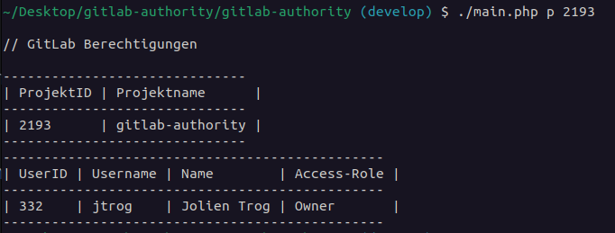

# GitLab-Authority
## Description
Is Skript is made to check Authority of Repositories by User and Projects in GitLab

## Getting started
Clone the Repo with SSH: 
```
git clone git@git.netways.de:jtrog/gitlab-authority.git
```
Make sure you have PHP installed.

#### Steps for PHP installation

Run the command for installing PHP:

``` 
sudo apt install php 
```

Run to see what version of PHP is installed:
``` 
php -v
``` 
### Composer and Vendor

Make sure you have Composer and Vendor/autoloader installed.

### Get your personal Access Token

To use the REST API of GitLab, you need to authenticate with a personal access Token.
You can create as many personal access tokens as you like.

1. On the left sidebar, select your avatar.
2. Select **Edit profile**.
3. On the left sidebar, select **Access Tokens**. 
4. Select **Add new token**. 
5. Enter a name and expiry date for the token.
   - The token expires on that date at midnight UTC.
   - If you do not enter an expiry date, the expiry date is automatically set to 365 days later than the current date.
   - By default, this date can be a maximum of 365 days later than the current date. 
6. Select the desired scopes **api**.
7. Select **Create personal access token**. 

Save the personal access token somewhere safe. After you leave the page, you no longer have access to the token.


### Execute the skript

Direct to the folder.
```
cd gitlab-authority
./main.php <arg1> <arg2>
```
You have to add 2 Arguments in the correct order:

1. Argument: 
   - **p** for Project
   - **u** for User
   
2. Argument
   - ID of the Project or User

For example:
```
./main.php p 2193
./mail.php u 332
```


Output:



***

## Visuals
Depending on what you are making, it can be a good idea to include screenshots or even a video (you'll frequently see GIFs rather than actual videos). Tools like ttygif can help, but check out Asciinema for a more sophisticated method.

## Installation
Within a particular ecosystem, there may be a common way of installing things, such as using Yarn, NuGet, or Homebrew. However, consider the possibility that whoever is reading your README is a novice and would like more guidance. Listing specific steps helps remove ambiguity and gets people to using your project as quickly as possible. If it only runs in a specific context like a particular programming language version or operating system or has dependencies that have to be installed manually, also add a Requirements subsection.

## Usage
Use examples liberally, and show the expected output if you can. It's helpful to have inline the smallest example of usage that you can demonstrate, while providing links to more sophisticated examples if they are too long to reasonably include in the README.

## Support
Tell people where they can go to for help. It can be any combination of an issue tracker, a chat room, an email address, etc.

## Roadmap
If you have ideas for releases in the future, it is a good idea to list them in the README.

## Contributing
State if you are open to contributions and what your requirements are for accepting them.

For people who want to make changes to your project, it's helpful to have some documentation on how to get started. Perhaps there is a script that they should run or some environment variables that they need to set. Make these steps explicit. These instructions could also be useful to your future self.

You can also document commands to lint the code or run tests. These steps help to ensure high code quality and reduce the likelihood that the changes inadvertently break something. Having instructions for running tests is especially helpful if it requires external setup, such as starting a Selenium server for testing in a browser.

## Authors and acknowledgment
Show your appreciation to those who have contributed to the project.

## License
For open source projects, say how it is licensed.

## Project status
If you have run out of energy or time for your project, put a note at the top of the README saying that development has slowed down or stopped completely. Someone may choose to fork your project or volunteer to step in as a maintainer or owner, allowing your project to keep going. You can also make an explicit request for maintainers.
