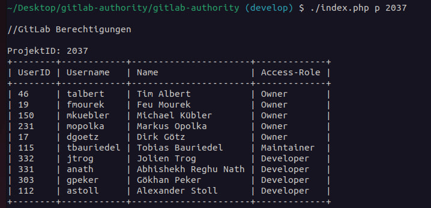
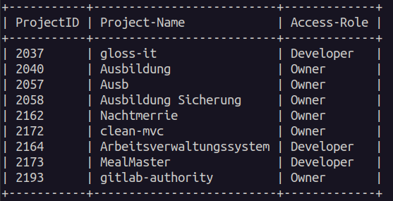

# GitLab-Authority

<div style="display: inline-block; vertical-align: middle;">
    
    Welcome to a small program to check GitLab-Authority of Users and Projects. It is a Skript for the terminal written in PHP and using a Library for a nice table output.
</div>

## Getting started
Clone the Repo with SSH:
```
git clone git@git.netways.de:jtrog/gitlab-authority.git
```
Make sure you have PHP installed.

#### Steps for PHP installation

Run the command for installing PHP:

``` 
sudo apt install php 
```

Run to see what version of PHP is installed:
``` 
php -v
``` 
### Composer and Vendor

Make sure you have Composer and Vendor/autoloader installed.

### Get your personal Access Token

To use the REST API of GitLab, you need to authenticate with a personal access Token.
You can create as many personal access tokens as you like.

1. On the left sidebar, select your avatar.
2. Select **Edit profile**.
3. On the left sidebar, select **Access Tokens**.
4. Select **Add new token**.
5. Enter a name and expiry date for the token.
   - The token expires on that date at midnight UTC.
   - If you do not enter an expiry date, the expiry date is automatically set to 365 days later than the current date.
   - By default, this date can be a maximum of 365 days later than the current date.
6. Select the desired scopes **api**.
7. Select **Create personal access token**.

Save the personal access token somewhere safe. After you leave the page, you no longer have access to the token.


### Execute the skript

Direct to the folder.
```
cd gitlab-authority
./main.php <arg1> <arg2>
```
You have to add 2 Arguments in the correct order:

1. Argument:
   - **p** for Project
   - **u** for User

2. Argument
   - ID of the Project or User

For example:
```
./main.php p 2193
./mail.php u 332
```


## Output for Projekt authority:



## Output for User authority:




## Authors
Jolien Trog

## License
Open source projects

## Project status
If you have run out of energy or time for your project, put a note at the top of the README saying that development has slowed down or stopped completely. Someone may choose to fork your project or volunteer to step in as a maintainer or owner, allowing your project to keep going. You can also make an explicit request for maintainers.